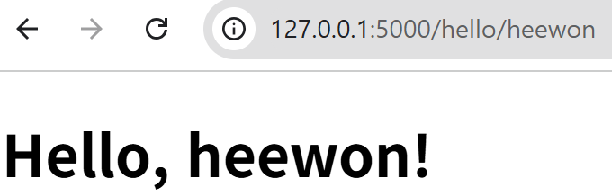
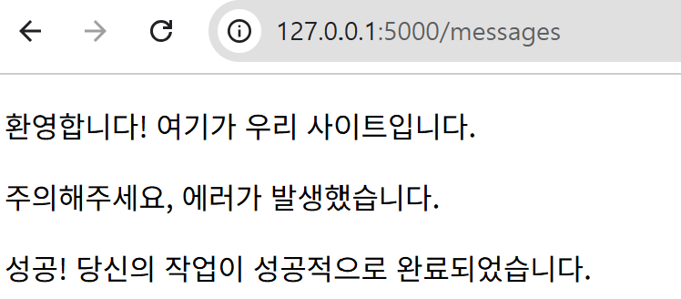

## 템플릿
**템플릿**은 웹페이지의 구조나 레이아웃을 미리 정의해 놓은 파일이다.

### 2.5.1 템플릿 기본 사용법
플라스크에서는 Jinja2라는 템플릿 엔진을 사용한다. Jinja2는 파이썬 코드를 HTML 파일에 삽입하여 웹페이지를 동적으로 생성할 수 있게 해준다. 
```
<!DOCTYPE html>
<html>
    <head>
        <title>Hello</title>
    </head>
    <body>
        <h1>Hello, {{ name }}! </h1> <!--{{name}} 부분은 Jinja2의 템플릿 문법이다. 이 위치에 파이썬 변수를 삽입할 수 있다. -->
    </body>
</html>
```
```
from flask import Flask, render_template

app = Flask(__name__)

@app.route('/hello/<name>')
def hello_name(name):
    return render_template('hello.html', name=name)
```



### 2.5.2 변수와 제어문
Jinja2 템플릿 엔진은 단순히 변수를 삽입하는 것뿐만 아니라, 제어문(If, For 등)도 사용할 수 있다.

### 2.5.3 필터
필터는 변수의 값을 출력하기 전에 처리하여 변형하는 기능을 제공한다. 

### 2.5.5 매크로
**매크로**를 사용하는 것은 파이썬에서 함수를 정의하고 호출하는 것과 아주 유사하다. 웹페이지에서 반복해서 사용되는 HTML 요소들을 매크로로 정의해두면, 여러 곳에서 필요할 때마다 그 매크로를 호출하여 재사용할 수 있다. 
```
<!-- templates/macros.html-->


<p>{{message}}</p> <!-- 여기서 정의된 display_message 매크로는 메시지라는 단 하나의 매개변수를 받아서 단순히 <p> 태그 안에 그 메시지를 출력-->

```
```
<!-- templates/messages.html -->
<!-- 이 파일에서는  구문을 통해 macros.html에서 display_message 매크로를 가져와서 사용한다. -->

<!DOCTYPE html>
<html>
<head>
    <meta charset="UTF-8">
    <title>Simple Message Example</title>
</head>
<body>
    
    <!-- 매크로 호출 -->
     {{ display_message('환영합니다! 여기가 우리 사이트입니다.')}}
     {{ display_message('주의해주세요, 에러가 발생했습니다.')}}
     {{ display_message('성공! 당신의 작업이 성공적으로 완료되었습니다.')}}
</body>
</html>
```



### 2.5.6 템플릿 상속
**템플릿 상속**을 이용하면 기본 레이아웃을 정의한 '부모' 템플릿을 만들고, 이를 '자식' 템플릿들이 상속받아서 사용할 수 있다. 이 방법은 웹페이지의 일관된 레이아웃을 유지하면서 코드의 반복을 피하고자 할 때 유용하다. 