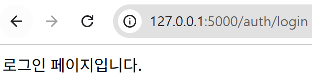

## 블루프린트

**블루프린트**는 플라스크에서 여러 컴포넌트를 논리적으로 그룹화하여 대규모 애플리케이션을 구성하는 방식이다. 이를 통해 기능별로 코드를 분리하고 재사용할 수 있으며, 마치 실제 건축에서 도면이 건물의 설계를 나타내듯 블루프린트는 웹 애플리케이션의 구조를 체계적으로 나타낸다. 

- 모듈화
- 재사용성
- 코드의 가독성

```
from flask import Blueprint, Flask

# Blueprint 객체 생성
# 첫 번째 인자는 블루프린트의 이름
# 두 번째 인자는 블루프린트가 정의되는 모듈의 이름으로, 일반적으로 '__name__'을 사용한다. 
auth_blueprint = Blueprint('auth', __name__)

# 블루프린트를 사용하여 라우트 정의
@auth_blueprint.route('/login')
def login():
    return '로그인 페이지입니다.'

@auth_blueprint.route('/logout')
def logout():
    return '로그아웃 되었습니다.'

app = Flask(__name__)

# 블루프린트 등록
app.register_blueprint(auth_blueprint, url_prefix='/auth')
```
